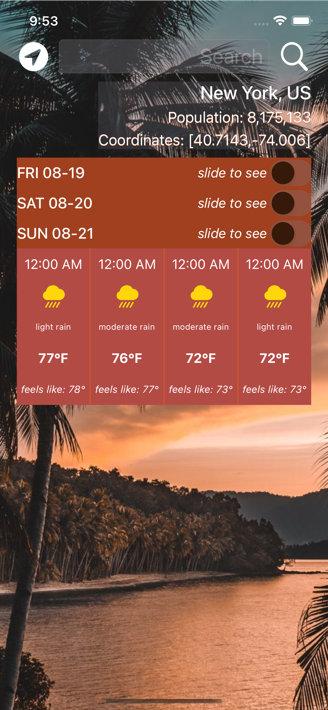

## Klimato 4 - iOS 4 Day Weather App :iphone: 
This is a mobile application for iOS devices which allows users to see the forecast for any location on the globe. The app provides information about the weather for the next 4 days, and for each day, it gives the weather forecast on 4 different hours of the day. The forecast has data about the population, coordinates, weather, and temperature of the location. This was made possible by using the OpenWeather API, where the forecast is available in JSON and XML format.
<p>By working on this project I was able to learn how to use UIStackView, NSLayoutConstraint, UISwitch, UIScrollView, Delegation, CLLocationManager, perform a URL request, and parse JSON by using JSONDecoder. </p>

<p><b>Tools</b>: Xcode.</p>
<p><b>Languages</b>: Swift. </p>
<p><b>API</b>: OpenWeather. </p>


#### Dark Mode


### How to use
1. Download source code :inbox_tray:
2. Unzip the downloaded folder :open_file_folder:
3. Open project in Xcode and play :calling:

**Using Terminal:**
```
  git clone https://github.com/acatarinaoaraujo/iOS-weather-app.git
  ```
 ### Contact
 <em> In case you want to contribute to this app, send me an email at acoa_@hotmail.com.</em> :postbox: :bulb:
